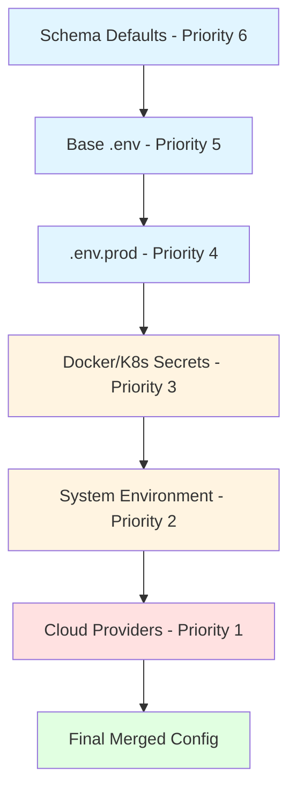

# Configuration Precedence

env-loader-pro uses a **deterministic precedence order** for resolving configuration values. This ensures predictable behavior across all environments with no ambiguity.

## Priority Order

Configuration sources are merged in the following order (highest to lowest priority):

1. **Cloud providers** (Azure Key Vault, AWS Secrets Manager)
2. **System environment variables**
3. **Docker/K8s mounted secrets**
4. **`.env.{env}`** (environment-specific file)
5. **Base `.env` file**
6. **Schema defaults**

**Rule**: Higher priority sources **override** lower priority ones. This order is **fixed and cannot be changed**.

## Visual Flow



## Detailed Precedence Rules

### 1. Cloud Providers (Highest Priority)

Cloud providers have the **highest priority** because:
- **Security**: Secrets should come from secure vaults
- **Override**: Production secrets must override local config
- **Compliance**: Audit trail for secret access

```python
from env_loader_pro import load_env
from env_loader_pro.providers import AzureKeyVaultProvider

provider = AzureKeyVaultProvider(vault_url="https://myvault.vault.azure.net")
config = load_env(providers=[provider])

# Values from Azure override everything else
```

!!! warning "Provider Priority"
    If multiple providers are specified, **later providers override earlier ones**:
    ```python
    config = load_env(providers=[azure_provider, aws_provider])
    # AWS values override Azure values for the same keys
    ```

### 2. System Environment Variables

System environment variables have priority 2:

```python
import os

# Set in system
os.environ["API_KEY"] = "system-key"

config = load_env()
print(config["API_KEY"])  # "system-key" (from system, overrides .env)
```

!!! note "System Environment Behavior"
    - Includes all `os.environ` variables
    - Overrides `.env` files
    - Can be set at runtime (Docker, Kubernetes, CI/CD)

### 3. Docker/K8s Mounted Secrets

Docker and Kubernetes secrets are auto-detected if available:

```python
# Automatically detected if /run/secrets or /etc/secrets exists
config = load_env(env="prod")
# Docker/K8s secrets override .env files but not system env
```

!!! tip "Auto-Detection"
    Docker/K8s secrets are automatically detected. No provider configuration needed.

### 4. Environment-Specific Files (`.env.{env}`)

Environment-specific files override the base `.env`:

```bash
# .env (base)
PORT=8080
DEBUG=false
LOG_LEVEL=info

# .env.prod (environment-specific)
PORT=9000
DEBUG=false
```

```python
config = load_env(env="prod")
print(config["PORT"])      # 9000 (from .env.prod)
print(config["DEBUG"])     # false (from .env.prod)
print(config["LOG_LEVEL"]) # info (from .env, .env.prod doesn't override)
```

### 5. Base `.env` File

Base `.env` file is loaded before environment-specific files:

```python
config = load_env()  # Loads .env only
# or
config = load_env(env="prod")  # Loads .env first, then .env.prod
```

### 6. Schema Defaults (Lowest Priority)

Schema defaults are only used if a value is not set elsewhere:

```python
config = load_env(
    defaults={"PORT": 8080, "DEBUG": False}
)
# Defaults only used if PORT/DEBUG not in any other source
```

## Merging Behavior

### Override Rules

When the same key exists in multiple sources:

1. **Higher priority wins** (cloud providers > system > files)
2. **Complete replacement** (not merged)
3. **No partial merging** (entire value is replaced)

```bash
# .env
DATABASE_HOST=localhost
DATABASE_PORT=5432

# System environment
export DATABASE_HOST=prod-db.example.com
```

```python
config = load_env()
print(config["DATABASE_HOST"])  # "prod-db.example.com" (system overrides)
print(config["DATABASE_PORT"])  # "5432" (from .env, system doesn't override)
```

### Example: Complete Resolution

```bash
# Schema defaults (lowest priority)
# PORT=8080 (default)

# .env (base)
PORT=9000
DEBUG=false

# .env.prod (environment-specific)
PORT=8000
API_URL=https://api.example.com

# System environment
export API_KEY=system-key-12345

# Azure Key Vault
DB_PASSWORD=azure-secret-password
```

```python
from env_loader_pro import load_env
from env_loader_pro.providers import AzureKeyVaultProvider

provider = AzureKeyVaultProvider(vault_url="https://myvault.vault.azure.net")
config = load_env(env="prod", providers=[provider], defaults={"PORT": 8080})

# Final resolved values:
print(config["PORT"])          # 8000 (from .env.prod, overrides .env and default)
print(config["DEBUG"])         # false (from .env, .env.prod doesn't override)
print(config["API_URL"])       # "https://api.example.com" (from .env.prod)
print(config["API_KEY"])       # "system-key-12345" (from system, overrides files)
print(config["DB_PASSWORD"])  # "azure-secret-password" (from Azure, highest priority)
```

## Variable Expansion and Precedence

Variable expansion happens **after** merging:

```bash
# .env
BASE_URL=https://example.com

# System environment
export API_ENDPOINT=${BASE_URL}/api
```

```python
config = load_env()
print(config["API_ENDPOINT"])  # "https://example.com/api"
# System env references .env variable, expansion happens after merge
```

!!! note "Expansion Order"
    1. All sources merged with precedence
    2. Variable expansion applied to final merged config
    3. This allows system env to reference .env variables

## Why This Order?

### Cloud Providers (Priority 1)

- **Security**: Secrets must come from secure vaults in production
- **Override**: Production secrets override local development config
- **Compliance**: Full audit trail for secret access

### System Environment (Priority 2)

- **Container-friendly**: Works with Docker/Kubernetes
- **CI/CD**: Easy to set in pipelines
- **Runtime**: Can be set at runtime without file changes

### Docker/K8s Secrets (Priority 3)

- **Container-native**: Standard container secret mounting
- **Secure**: Managed by orchestration platform
- **Scalable**: Works across pods

### Environment-Specific Files (Priority 4)

- **Flexibility**: Different configs per environment
- **Override**: Environment-specific overrides base
- **Version control**: Can be tracked in git (without secrets)

### Base .env File (Priority 5)

- **Development**: Local development defaults
- **Documentation**: Shows required variables
- **Fallback**: Base configuration

### Schema Defaults (Priority 6)

- **Last resort**: Only used if not set elsewhere
- **Type safety**: Provides typed defaults
- **Documentation**: Shows expected values

## CLI Explanation

Use the CLI to see precedence for your configuration:

```bash
envloader explain
```

Output:
```
Resolution order:
1. cloud_providers - Cloud providers (Azure Key Vault, AWS Secrets Manager)
2. system - System environment variables
3. docker_k8s - Docker/K8s mounted secrets
4. env_specific - .env.prod (environment-specific file)
5. base_file - Base .env file
6. schema_defaults - Schema default values
```

## Tracing Origins

See where each variable came from:

```python
config = load_env(trace=True)

# Get origin of a variable
origin = config.trace("API_KEY")
# Returns: "azure", "aws", "system", "file", etc.

# Get all origins
origins = config.get_origins()
# {"API_KEY": "azure", "PORT": "file", ...}
```

## Best Practices

1. **Use cloud providers for secrets** in production
   ```python
   # Production: secrets from Azure
   config = load_env(env="prod", providers=[azure_provider])
   ```

2. **Use .env files for defaults** in development
   ```python
   # Development: local .env file
   config = load_env(env="dev")
   ```

3. **Use system env in CI/CD** for pipeline-specific values
   ```bash
   # CI/CD: set in pipeline
   export BUILD_NUMBER=123
   ```

4. **Use schema defaults** for documentation and type hints
   ```python
   config = load_env(defaults={"PORT": 8080, "DEBUG": False})
   ```

5. **Enable audit trail** to see where values come from
   ```python
   config, audit = load_env(audit=True)
   print(audit.get_summary())
   ```

## Common Mistakes

### Mistake 1: Expecting Partial Merging

```python
# ❌ WRONG: Expecting partial merge
# .env: DATABASE_HOST=localhost
# System: DATABASE_PORT=5432
# Expecting: {HOST: localhost, PORT: 5432}

# ✅ CORRECT: Each source completely overrides
# System env doesn't merge with .env, it replaces
```

### Mistake 2: Assuming Defaults Override

```python
# ❌ WRONG: Defaults don't override existing values
config = load_env(
    defaults={"PORT": 8080}
)
# If PORT exists in .env, default is ignored

# ✅ CORRECT: Defaults only used if missing
# Remove PORT from .env to use default
```

### Mistake 3: Multiple Providers Order

```python
# ❌ WRONG: Assuming first provider wins
config = load_env(providers=[azure_provider, aws_provider])

# ✅ CORRECT: Later providers override earlier ones
# AWS values override Azure values
```

## Related Topics

- [Audit Trail](../enterprise/audit.md) - Track variable provenance
- [Providers](../providers/overview.md) - Cloud secrets integration
- [Security Model](../security/model.md) - Security guarantees
