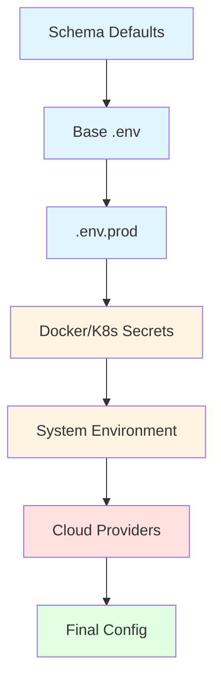

# env-loader-pro

<div class="hero" markdown>

## Enterprise-Grade Configuration Management

**Typed, validated, and secure environment variable loader** for Python with automatic type casting, validation, secret masking, cloud secrets integration, and full observability.

[Get Started :material-arrow-right:](getting-started/installation.md){ .md-button .md-button--primary }
[View on GitHub :fontawesome-brands-github:](https://github.com/shanen28/env-loader-pro){ .md-button }

</div>

---

## What Problem Does This Solve?

Traditional `.env` loaders are basic and unsafe. **env-loader-pro** provides enterprise-grade features for production environments:

- **Type Safety** - Automatic casting to int, bool, list, etc.
- **Cloud Secrets** - Azure Key Vault, AWS Secrets Manager integration
- **Audit Trail** - Complete provenance tracking for compliance
- **Policy Enforcement** - Policy-as-code for configuration governance
- **CI/CD Safe** - All commands work without cloud credentials
- **Secret Security** - Automatic masking, never logs secrets

---

## Quick Start

=== "Installation"

    ```bash
    pip install env-loader-pro
    ```

=== "Basic Usage"

    ```python
    from env_loader_pro import load_env

    config = load_env(
        required=["API_KEY"],
        types={"PORT": int, "DEBUG": bool},
        defaults={"PORT": 8080}
    )

    print(config["PORT"])   # 8080 (int)
    print(config["DEBUG"])  # True (bool)
    ```

=== "With Cloud Secrets"

    ```python
    from env_loader_pro import load_env
    from env_loader_pro.providers import AzureKeyVaultProvider

    provider = AzureKeyVaultProvider(
        vault_url="https://myvault.vault.azure.net"
    )

    config = load_env(
        env="prod",
        providers=[provider],
        audit=True  # Track provenance
    )
    ```

---

## Key Features

<div class="grid cards" markdown>

-   :material-shield-check:{ .lg .middle } __Security First__

    ---

    Automatic secret masking, audit trail, policy enforcement, and encrypted file support. Never logs secrets in plaintext.

    [:octicons-arrow-right-24: Learn More](security/model.md)

-   :material-cloud:{ .lg .middle } __Cloud Secrets__

    ---

    Seamless integration with Azure Key Vault, AWS Secrets Manager, and AWS SSM Parameter Store. Secrets override local config.

    [:octicons-arrow-right-24: Learn More](providers/overview.md)

-   :material-file-document-multiple:{ .lg .middle } __Audit Trail__

    ---

    Complete provenance tracking for compliance. Know exactly where each configuration value came from, without storing secrets.

    [:octicons-arrow-right-24: Learn More](enterprise/audit.md)

-   :material-code-json:{ .lg .middle } __Policy-as-Code__

    ---

    Enforce configuration policies via JSON/YAML files. Require variables, forbid debug flags, enforce source requirements.

    [:octicons-arrow-right-24: Learn More](enterprise/policy-as-code.md)

-   :material-git:{ .lg .middle } __CI/CD Safe__

    ---

    All CLI commands work without cloud credentials. Perfect for CI pipelines with deterministic behavior and proper exit codes.

    [:octicons-arrow-right-24: Learn More](security/ci-safety.md)

-   :material-speedometer:{ .lg .middle } __Performance__

    ---

    Caching, circuit breakers, and performance monitoring with SLAs. Cold start < 500ms, warm load < 50ms, cached < 5ms.

    [:octicons-arrow-right-24: Learn More](enterprise/performance.md)

</div>

---

## Configuration Precedence

env-loader-pro uses a **deterministic precedence order** for resolving configuration values:



**Priority Order** (highest to lowest):

1. **Cloud providers** (Azure Key Vault, AWS Secrets Manager)
2. **System environment variables**
3. **Docker/K8s mounted secrets**
4. **`.env.{env}`** (environment-specific file)
5. **Base `.env` file**
6. **Schema defaults**

[:octicons-arrow-right-24: Learn More](core-concepts/precedence.md)

---

## Security Guarantees

!!! success "Production Ready"

    env-loader-pro is designed with security as a first-class concern:

    - ✅ **No secrets in logs** - Automatic masking in all outputs
    - ✅ **Audit trail** - Complete provenance tracking without values
    - ✅ **Policy enforcement** - Require/forbid variables via policy files
    - ✅ **Secret change detection** - Prevent accidental exposure
    - ✅ **CI/CD safe** - No cloud access required for validation

[:octicons-arrow-right-24: Security Model](security/model.md)

---

## CLI Tool

The `envloader` command-line tool provides powerful operations:

```bash
# Validate configuration (CI-safe)
envloader validate --ci --required API_KEY PORT

# Show audit trail
envloader audit --json

# Explain precedence
envloader explain

# Configuration diff
envloader diff --ci --deny-secret-changes
```

[:octicons-arrow-right-24: CLI Reference](cli/commands.md)

---

## Installation

=== "Basic Installation"

    ```bash
    pip install env-loader-pro
    ```

=== "With Cloud Providers"

    ```bash
    # Azure Key Vault
    pip install env-loader-pro[azure]

    # AWS Secrets Manager
    pip install env-loader-pro[aws]

    # Everything
    pip install env-loader-pro[all]
    ```

=== "Development"

    ```bash
    git clone https://github.com/shanen28/env-loader-pro.git
    cd env-loader-pro
    pip install -e ".[test,all]"
    ```

---

## Documentation

<div class="grid cards" markdown>

-   __[Getting Started](getting-started/installation.md)__

    Installation, quick start, and basic usage examples.

-   __[Core Concepts](core-concepts/precedence.md)__

    Configuration precedence, type casting, validation, and schema support.

-   __[Providers](providers/overview.md)__

    Cloud secrets integration with Azure, AWS, Docker, and Kubernetes.

-   __[Enterprise Features](enterprise/audit.md)__

    Audit trail, failure policies, policy-as-code, and performance monitoring.

-   __[Security](security/model.md)__

    Security model, secret masking, encrypted files, and CI/CD safety.

-   __[Architecture](architecture/overview.md)__

    Technical design, principles, and provider system.

</div>

---

## Why env-loader-pro?

!!! tip "vs python-dotenv"

    | Feature | python-dotenv | env-loader-pro |
    |---------|---------------|----------------|
    | Load .env | ✅ | ✅ |
    | Type casting | ❌ | ✅ |
    | Validation | ❌ | ✅ |
    | Cloud secrets | ❌ | ✅ |
    | Audit trail | ❌ | ✅ |
    | Policy enforcement | ❌ | ✅ |
    | CI/CD safe | ❌ | ✅ |

---

## Get Started

Ready to use env-loader-pro in your project?

[:octicons-arrow-right-24: Installation Guide](getting-started/installation.md){ .md-button .md-button--primary }
[:octicons-arrow-right-24: Quick Start](getting-started/quickstart.md){ .md-button }

---

## Links

- **GitHub**: [shanen28/env-loader-pro](https://github.com/shanen28/env-loader-pro)
- **PyPI**: [env-loader-pro](https://pypi.org/project/env-loader-pro/)
- **Issues**: [GitHub Issues](https://github.com/shanen28/env-loader-pro/issues)

---

## License

Apache License 2.0 - See [LICENSE](https://github.com/shanen28/env-loader-pro/blob/main/LICENSE) file for details.
